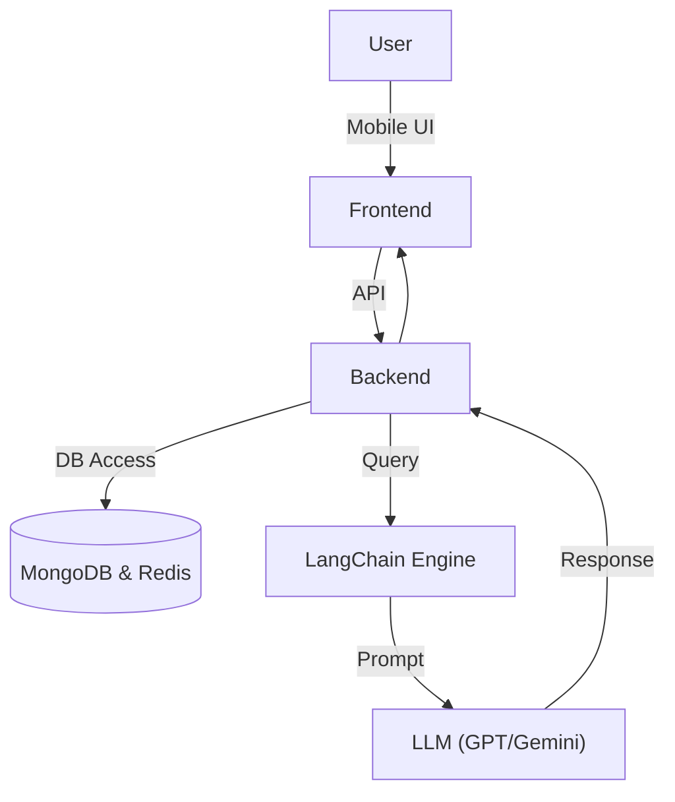

# Finance Guide – Smart Loan & Repayment Assistant

**Finance Guide** is an AI-powered mobile-first finance tracker that helps **Clients (Borrowers)** and **Senders (Lenders)** manage loans, track installments and get smart, personalized repayment suggestions using **LangChain RAG + LLMs** (GPT/Gemini).

---

## 📸 Overview

- 📊 Track loan balance, dues, interest
- 💬 AI Chat Assistant for smart finance help
- 🔔 Installment reminders & penalty alerts
- 📱 Mobile-first with Expo + React Native
- 🔙 Scalable backend with Node & Express, MongoDB, Redis

---

## 🧠 System Architecture

### ➤ High-Level Flow




### ➤ LangChain RAG Flow

```text
User Query ➝ Embed ➝ Semantic Search ➝ Context + Query ➝ GPT ➝ Smart Suggestion
```

📊 **Visual Architectures:**

* [System Diagram (Draw.io)](https://drive.google.com/file/d/1ymtVQCevhYCa5N-bF1XyKI7aeYPo4pR7/view?usp=sharing)

---

## 🧑‍💼 User Roles

* **Client (Borrower)** – Adds loan, views repayments, receives suggestions
* **Sender (Lender)** – Reviews loan status, receives payments
* **Admin** – (optional) Platform monitoring and control

---

## 🔧 Tech Stack

| Layer           | Stack                                                       |
| --------------- | ----------------------------------------------------------- |
| Mobile Frontend | Expo + React Native, Tailwind (NativeWind), Axios, Recharts |
| Backend         | Node.js + Express.js                         |
| Database        | MongoDB (relational), Redis (jobs/cache)                 |
| AI Layer        | LangChain + GPT                               |
| Vector Store    | ChromaDB / Pinecone                                         |
| Notifications   | node-cron + Twilio/SendGrid              |
| DevOps          | Docker, Vercel (frontend), Railway / Render (backend)       |

---

## 📦 Folder Structure

```
/finace-guide
├── frontend        # Expo mobile app
├── backend         # Node API + AI engine
├── .env.example    # Secret Keys of project
├── .gitignore
└── CODE_OF_CONDUCT.md
├── CONTRIBUTING.md
└── README.md
├── SUPPORT.md
├── docker-compose.yml  # (Optional)
```

---

## 📱 Frontend (Expo + React Native)

### Features

* 🔐 Login / Register
* 📊 Dashboards (Sender/Client)
* ➕ Add Loan / Track Installments
* 💬 AI Chat Assistant
* 🔔 Notification Center

### Tech Stack

* `React Native + Expo`
* `Tailwind CSS (NativeWind)`
* `Axios` for API integration
* `File-based Routing` via `expo-router`
* `Charts` via Victory/Recharts

### Run Locally

```bash
cd frontend
npm install
npx expo start
```

* Run on **Android/iOS simulator** or **Expo Go**
* Uses `.env` for base API URL and keys

---

## 🧠 Backend (API + AI + DB)

### Core Models

* `User`: Auth, roles
* `Loan`: Principal, interest, sender, client
* `Installment`: Amount, due date, paid status
* `Reminder`: Notification logs and flags

### Key APIs

| Method | Endpoint         | Description         |
| ------ | ---------------- | ------------------- |


### Backend Setup

```bash
cd backend

npm install
npm run dev
```

✅ Add environment variables in `.env`
✅ Set up MongoDB & Redis (Docker or local)

---

## 🤖 AI + LangChain Integration

* User uploads PDF or provides context
* LangChain splits, embeds, and stores docs
* Queries are embedded and searched via ChromaDB or Pinecone
* Contextual prompts sent to GPT
* Result returned to frontend via `/suggestions/` endpoint

---

## 🔔 Notifications & Reminders

Engine powered by:

* **Node + node-cron**
* **Redis** for job queueing
* **SendGrid** (Email) or **Twilio** (SMS)

Triggers:

* Due date approaching
* Missed/partial payments
* Full repayment alerts

---

## 🐳 Dockerized Setup (Optional)

```bash
docker-compose up --build
```

* Services: `web`, `db`, `redis`, `frontend`
* Configure using `.env` and Docker volumes

---

## 📊 UI/UX Screens (Planned in Figma)

* 📥 Login/Register
* 📋 Add Loan / Installments
* 📈 Repayment Timeline (chart)
* 🤖 AI Chat Assistant
* 🔔 Notification Center

---

## 🛡️ Security

* All auth via JWT
* Sensitive data managed using `.env` + Docker Secrets
* CORS policies enabled

---

## 📈 Future Enhancements

* Admin Panel
* Offline Mode / Caching
* PDF Upload with Summarized Insights
* Multi-language Support (i18n)

---

## Thank You!!

